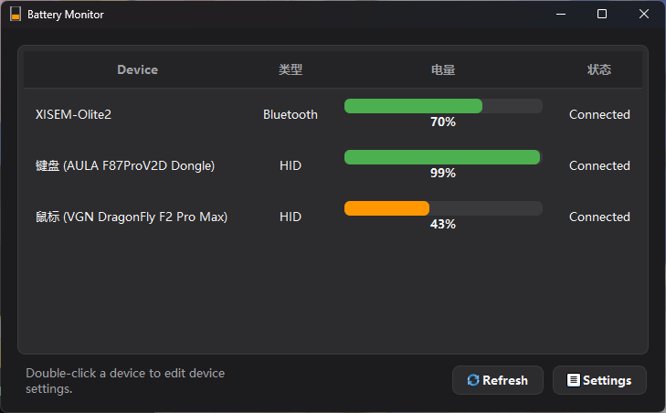

# BatteryMonitor

English | [简体中文](README.md)




BatteryMonitor is a Windows desktop battery monitor for common wireless peripherals. It shows device battery status in a main window and in the system tray.

The project is built with Qt 6 and CMake. It uses multiple providers to read battery information from Bluetooth devices, Xbox controllers, and HID 2.4G dongles, then presents them through a unified UI.

## Verified Devices

Only the following devices have been tested so far:

| Device Type                             | PID/VID                                                                   | Verification Status |
| --------------------------------------- | ------------------------------------------------------------------------- | ------------------- |
| Generic Bluetooth devices               | No fixed USB VID/PID; uses Windows Bluetooth device information           | Verified            |
| AULA F87ProV2D + AULA F87ProV2D Dongle | VID`0x0C45` / PID `0xFEFE`                                            | Verified            |
| AJAZZ MK87PRO + HS USB Dongle           | VID`0x0C45` / PID `0xFEFC`                                            | Verified            |
| VGN DragonFly F2 Pro Max + Dongle       | VGN MouseEnc protocol family; actual VID/PID depends on the device report | Verified            |
| AirPods 2                               | Apple Company ID`0x004C` / Model ID `0x200F`                          | Verified            |
| Xbox controller                         | VID`0x045E`; PID depends on the exact model                             | Verified            |
| Razer Basilisk X HyperSpeed + Dongle    | VID`0x1532` / PID `0x0083`                                            | Verified            |
| Razer BlackWidow V4 Mini HyperSpeed (Wireless) | VID`0x1532` / PID `0x02BA`                                            | Verified            |

## Theoretically Supported Devices

Besides the verified devices above, the code also contains adapter logic for some devices in the same brand, protocol family, or VID/PID range. These devices are theoretically supported, but they have not been tested in the author's environment.

| Device Type                                        | PID/VID                                                                               | Verification Status     |
| -------------------------------------------------- | ------------------------------------------------------------------------------------- | ----------------------- |
| AULA / AJAZZ 2.4G dongle devices                   | VID`0x0C45`, 2.4G dongle PID allowlist only                                         | Theoretical, unverified |
| VGN / related-brand 2.4G dongle keyboards and mice | Multiple VID/PID values, built-in protocol families and partial VID fallback matching | Theoretical, unverified |
| Razer mice / keyboards                             | VID`0x1532`, built-in PID table                                                     | Theoretical, unverified |
| AirPods / Beats series                             | Apple Company ID`0x004C`, built-in Model ID table                                   | Theoretical, unverified |
| Xbox / XInput / Windows game controllers           | Microsoft VID`0x045E` or Windows controller interfaces                              | Theoretical, unverified |
| Standard BLE Battery Service devices               | BLE GATT Battery Service, no fixed USB VID/PID                                        | Theoretical, unverified |
| Classic Bluetooth audio devices                    | Windows BTHENUM device property, no fixed USB VID/PID                                 | Theoretical, unverified |

If your device can be detected and its battery can be read correctly, device model and test results are welcome. They can be added to the verified device list later.

Note: AULA / AJAZZ wired USB keyboard bodies are not included in the current HID battery reading scope, even when they are visible through WebHID. The provider only reads battery data for devices behind a 2.4G dongle.

## Features

- Shows battery percentage or battery level
- System tray support
- Per-device tray visibility setting
- Low battery notifications and notification policies
- Per-device alias
- Stale battery cache for disconnected or temporarily unreadable devices
- Option to hide unpaired AirPods / Beats advertisements
- Start with Windows and minimize to tray
- Light, dark, and system theme modes
- Chinese UI support
- Built-in WebSocket JSON-RPC interface for external tools like StreamDock and Home Assistant to read device battery data

## Current Read Methods

The project is split into several providers by device source:

- `BluetoothProvider`: reads BLE GATT Battery Service / Windows battery information
- `ClassicBluetoothProvider`: reads classic Bluetooth device battery from Windows device properties
- `AirPodsProvider`: parses Apple Continuity BLE advertisements for AirPods / Beats left, right, and case battery levels
- `XboxProvider`: reads Xbox controller battery through XInput, RawGameController, and Windows device properties
- `AulaHidProvider`: reads AULA 2.4G dongle device battery through hidapi
- `AsusRogHidProvider`: reads battery level and charging state from the ROG Strix Scope RX TKL Wireless Deluxe dongle through hidapi
- `VgnHidProvider`: reads VGN / related-brand 2.4G dongle device battery through hidapi
- `RazerHidProvider`: reads Razer mouse / keyboard battery through hidapi

## Requirements

- Windows
- Qt 6.5 or later
- CMake 3.19 or later
- MSVC toolchain with C++17 support
- Windows SDK with Desktop C++ Apps / cppwinrt headers

The `external/hidapi` directory contains the prebuilt Windows hidapi files used by this project. `hidapi.dll` is copied to the output directory after build.

## Build

Run the following commands in a shell where Qt and MSVC are configured:

```powershell
cmake -S . -B build
cmake --build build --config Release
```

The executable is generated by default at:

```text
bin/BatteryMonitor.exe
```

You can also open `CMakeLists.txt` directly with Qt Creator.

## Usage

After launch, the main window shows the currently detected devices. Closing the window does not exit the app; it keeps running in the system tray. Use the tray menu to quit completely.

Click a device to open its detail page and configure:

- Device alias
- Whether to show it in the tray
- Whether to enable low battery notifications
- Low battery notification threshold
- Low battery notification policy
- Whether to keep the device cached forever

The settings page allows configuring:

- Refresh interval
- Language
- Theme
- Start with Windows
- Stale cache retention time
- Whether to hide unpaired AirPods
- WebSocket service toggle, listen port, bind address, and authentication token

## WebSocket API

BatteryMonitor includes a built-in WebSocket JSON-RPC 2.0 server, disabled by default. Once enabled, external tools (such as StreamDock, Home Assistant, Rainmeter, or custom dashboards) can retrieve device battery snapshots, subscribe to real-time updates, trigger refreshes, and read/write global and per-device preferences via JSON-RPC.

**Enabling the server:**

- Toggle "WebSocket service" in the settings page (persisted, auto-restored on next launch). Port, bind address, and auth token can be configured on the same page.
- Or start via command-line arguments (force-enabled for this session, not persisted):

  ```text
  BatteryMonitor.exe --websocket_server                  # uses the configured port, default 19211
  BatteryMonitor.exe --websocket_server --port 8080      # overrides port for this session
  BatteryMonitor.exe --minimized --websocket_server      # starts hidden to tray with the server
  ```

Listens on `ws://127.0.0.1:19211/` by default (localhost only, no auth required). For the full method list, data model, error codes, and interaction examples, see [docs/websocket-api-en.md](docs/websocket-api-en.md).

A ready-to-use test page is also included at [docs/websocket-test.html](docs/websocket-test.html) — open it directly in a browser to connect to the server, call all methods, view real-time push and device details, with Chinese/English language switching.

## Project Structure

```text
.
├── main.cpp                         # Application entry, provider registration, language/theme setup
├── mainwindow.cpp / mainwindow.h     # Main window, tray, settings page, device detail page
├── src/core                         # Device model, provider interface, BatteryManager aggregation logic
├── src/providers/bluetooth          # Bluetooth / AirPods providers
├── src/providers/hid                # AULA / VGN / Razer HID providers
├── src/providers/xbox               # Xbox provider
├── src/rpc                          # WebSocket JSON-RPC server
├── util                             # Settings, logging, version information
├── lang                             # Qt translation files
├── res                              # Icons and Qt resources
└── external/hidapi                  # Prebuilt hidapi Windows dependency
```

## Device Adaptation

To add support for a new device, you usually need to add or extend the corresponding provider:

- Standard Bluetooth battery devices: start with `BluetoothProvider`
- Classic Bluetooth audio devices: start with `ClassicBluetoothProvider`
- Apple audio devices: start with `AirPodsProvider`
- XInput / Windows game controllers: start with `XboxProvider`
- 2.4G dongles or private-protocol devices: extend `src/providers/hid` according to the HID protocol

After adding a provider, register it in `main.cpp` with `BatteryManager` to reuse the existing UI, tray, low battery notification, and cache logic.

## Special Thanks

Thanks to the [hidapi](https://github.com/libusb/hidapi) project. This project uses hidapi to communicate with Windows HID devices for battery reading.

## License

This project is open-sourced under the MIT License. See [LICENSE](LICENSE).
