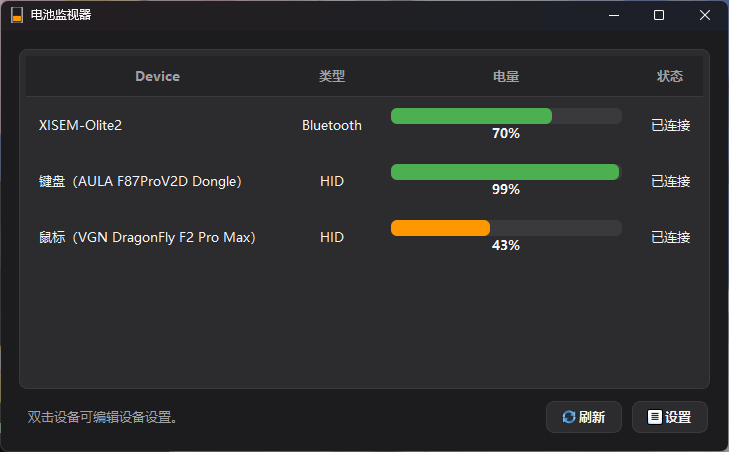
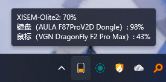

# BatteryMonitor

[English](README.en.md) | 简体中文





BatteryMonitor 是一个 Windows 桌面电量监控工具，用来在一个窗口和系统托盘里查看常用无线外设的电量。

项目基于 Qt 6 / CMake 开发，通过多个 Provider 分别读取蓝牙、Xbox 和 HID 2.4G 接收器设备的电量，并在界面中统一展示。

## 已验证设备

目前验证过的设备只有：

| 设备类型                               | PID/VID                                          | 是否验证 |
| -------------------------------------- | ------------------------------------------------ | -------- |
| 普通蓝牙设备                           | 无固定 USB VID/PID，走 Windows 蓝牙设备信息      | 已验证   |
| AULA F87ProV2D + AULA F87ProV2D Dongle | VID`0x0C45` / PID `0xFEFE`                   | 已验证   |
| AJAZZ MK87PRO + HS USB Dongle          | VID`0x0C45` / PID `0xFEFC`                   | 已验证   |
| ATK V75X + ATK V75X Dongle            | VID`0x320F` / PID `0x5055`（USB），PID `0x5088`（Dongle） | 已验证   |
| VGN DragonFly F2 Pro Max + Dongle     | VGN MouseEnc 协议族，VID/PID 以设备实际上报为准  | 已验证   |
| AirPods 2                              | Apple Company ID`0x004C` / Model ID `0x200F` | 已验证   |
| Xbox 手柄                              | VID`0x045E`，PID 依具体型号而定                | 已验证   |
| Razer Basilisk X HyperSpeed + Dongle   | VID`0x1532` / PID `0x0083`                   | 已验证   |
| Razer BlackWidow V4 Mini HyperSpeed (Wireless) | VID`0x1532` / PID `0x02BA`                   | 已验证   |
| ROG Strix Scope RX TKL Wireless Deluxe + Dongle | VID`0x0B05` / PID `0x1A07`                | 已验证   |
| ROG Keris Wireless AimPoint                    | VID`0x0B05` / PID `0x1A66`（有线）或 `0x1A68`（2.4G） | 已验证   |
| Logitech MX Master 4 + Bolt 接收器       | VID`0x046D` / PID `0xC548`，HID++ 2.0 `0x1004` | 已验证   |
| Razer Mouse Dock Pro + Razer Basilisk V3 Pro 35K (Wireless) | VID`0x1532` / PID `0x00A4` (底座) + PID `0x00CD` (鼠标) | 已验证 |

## 理论支持设备

除上述已验证设备外，代码中也包含一些同品牌、同协议族或同 VID/PID 范围内设备的适配逻辑。这些设备属于理论支持范围，但尚未在作者环境中实际验证。

| 设备类型                             | PID/VID                                          | 是否验证         |
| ------------------------------------ | ------------------------------------------------ | ---------------- |
| AULA / AJAZZ 2.4G 接收器设备         | VID`0x0C45`，仅启用 2.4G dongle PID 白名单     | 理论支持，未验证 |
| VGN / 关联品牌 2.4G 接收器键盘、鼠标 | 多个 VID/PID，代码内置协议族和部分 VID 兜底匹配  | 理论支持，未验证 |
| Razer 鼠标 / 键盘                    | VID`0x1532`，代码内置 PID 表                   | 理论支持，未验证 |
| ASUS ROG / TUF 鼠标                  | VID`0x0B05`；Chakram、Gladius、Harpe、Keris、Pugio、Spatha、Strix、TUF 等型号，代码内置 PID 表 | 理论支持，未验证 |
| Logitech HID++ 2.0 接收器设备        | Bolt / Unifying / Nano / Lightspeed；电池 Feature `0x1004` / `0x1000` / `0x1001` | 理论支持，未验证 |
| AirPods / Beats 系列                 | Apple Company ID`0x004C`，代码内置 Model ID 表 | 理论支持，未验证 |
| Xbox / XInput / Windows 游戏控制器   | Microsoft VID`0x045E` 或 Windows 控制器接口    | 理论支持，未验证 |
| 标准 BLE 电量服务设备                | BLE GATT Battery Service，无固定 USB VID/PID     | 理论支持，未验证 |
| 经典蓝牙音频设备                     | Windows BTHENUM 设备属性，无固定 USB VID/PID     | 理论支持，未验证 |

如果你的设备能被识别并正常读取电量，欢迎提交设备型号和测试结果，后续可以补充到已验证设备列表。

说明：AULA / AJAZZ 有线 USB 键盘本体即使能被 WebHID 枚举到，目前也不纳入 HID 电量读取范围；当前只读取 2.4G dongle 后挂接设备的电量。

## 功能

- 查看设备电量百分比或电量档位
- 支持系统托盘显示
- 支持按设备设置是否显示到托盘
- 支持低电量提醒和提醒策略
- 支持设备别名
- 支持设备掉线后的电量缓存显示
- 支持隐藏未配对的 AirPods / Beats 广播
- 支持开机自启并最小化到托盘
- 支持浅色、深色、跟随系统主题
- 支持中文界面
- 支持 WebSocket JSON-RPC 接口，供 StreamDock、Home Assistant 等外部工具读取设备电量
- 支持按设备查看电量历史图表，并按所选时间范围导出 CSV

## 当前读取方式

项目内部按设备来源拆分为多个 Provider：

- `BluetoothProvider`：读取 BLE GATT Battery Service / Windows 电池信息
- `ClassicBluetoothProvider`：读取经典蓝牙设备的 Windows 设备属性电量
- `AirPodsProvider`：解析 Apple Continuity BLE 广播，读取 AirPods / Beats 左耳、右耳、充电盒电量
- `XboxProvider`：通过 XInput、RawGameController 和 Windows 设备属性读取 Xbox 手柄电量
- `AulaHidProvider`：通过 hidapi 读取 AULA 2.4G 接收器设备电量
- `AsusRogHidProvider`：通过 hidapi 读取 ROG Strix Scope RX TKL Wireless Deluxe 接收器设备电量和充电状态
- `AsusMouseHidProvider`：通过 hidapi 读取 ASUS ROG / TUF 鼠标的电量和充电状态
- `LogitechHidProvider`：通过 HID++ 2.0 的 Unified Battery、Battery Status 或 Battery Voltage 读取 Logitech 接收器设备的电量和充电状态
- `VgnHidProvider`：通过 hidapi 读取 VGN / 关联品牌 2.4G 接收器设备电量
- `RazerHidProvider`：通过 hidapi 读取 Razer 鼠标 / 键盘电量

## 环境要求

- Windows
- Qt 6.5 或更高版本
- CMake 3.19 或更高版本
- 支持 C++17 的 MSVC 工具链
- Windows SDK，需包含 Desktop C++ Apps / cppwinrt 头文件

`external/hidapi` 目录中已包含当前项目使用的 Windows 版 hidapi 预编译文件。构建后会自动把 `hidapi.dll` 拷贝到输出目录。

## 构建

在已配置 Qt 和 MSVC 环境的命令行中执行：

```powershell
cmake -S . -B build
cmake --build build --config Release
```

默认可执行文件输出到：

```text
bin/BatteryMonitor.exe
```

也可以直接用 Qt Creator 打开本项目的 `CMakeLists.txt` 构建运行。

## 使用说明

启动后主窗口会显示当前读取到的设备列表。关闭窗口时程序不会退出，而是继续驻留在系统托盘；如需完全退出，请使用托盘菜单。

点击设备可以进入设备详情页，配置：

- 设备别名
- 是否显示到托盘
- 是否启用低电量提醒
- 低电量提醒阈值
- 低电量提醒策略
- 是否永久缓存该设备

设备详情页还提供最近 24 小时、7 天、30 天或全部历史的电量曲线。AirPods / Beats
会分别显示左耳、右耳和充电盒电量；点击「导出 CSV」可导出当前设备和当前时间范围的完整记录。

设置页中可以配置：

- 刷新间隔
- 语言
- 主题
- 开机自启
- 掉线缓存保留时长
- 是否隐藏未配对 AirPods
- WebSocket 服务开关、监听端口、监听地址、鉴权令牌
- 电量历史保留时长（默认 30 天，可选永久保留）

历史数据保存在用户应用数据目录的 `battery-history.sqlite` 中。电量或连接状态变化时会立即记录，
稳定期间每 5 分钟补充一条心跳记录；CSV 使用 UTF-8 编码，可直接交给 Excel 或分析脚本处理。

## WebSocket API

BatteryMonitor 内置一个 WebSocket JSON-RPC 2.0 服务，默认关闭。开启后，外部工具（如 StreamDock、Home Assistant、Rainmeter、自写看板）可通过 JSON-RPC 获取设备电量快照、订阅实时更新、触发刷新、读写全局与按设备的偏好设置。

**启用方式：**

- 在设置页打开「WebSocket 服务」开关（持久化，下次启动自动恢复），同页可配置端口、监听地址和鉴权令牌。
- 或通过命令行参数启动（本次强制开启，不写盘）：

  ```text
  BatteryMonitor.exe --websocket_server                  # 使用设置中的端口，默认 19211
  BatteryMonitor.exe --websocket_server --port 8080      # 本次覆盖端口
  BatteryMonitor.exe --minimized --websocket_server      # 静默进托盘并启动服务
  ```

默认监听 `ws://127.0.0.1:19211/`（仅本机回环，无需鉴权）。完整的方法列表、数据模型、错误码和交互示例见 [docs/websocket-api.md](docs/websocket-api.md)。

仓库还附带一个开箱即用的测试页面 [docs/websocket-test.html](docs/websocket-test.html)，浏览器直接打开即可连接服务、调用全部方法、查看实时推送与设备详情，支持中英文切换。

## 项目结构

```text
.
├── main.cpp                         # 应用入口、Provider 注册、语言/主题初始化
├── mainwindow.cpp / mainwindow.h     # 主窗口、托盘、设置页、设备详情页
├── src/core                         # 设备模型、Provider 接口、BatteryManager 聚合逻辑
├── src/providers/bluetooth          # 蓝牙 / AirPods Provider
├── src/providers/hid                # AULA / Logitech / VGN / Razer HID Provider
├── src/providers/xbox               # Xbox Provider
├── src/rpc                          # WebSocket JSON-RPC 服务
├── util                             # 设置、日志、版本信息
├── lang                             # Qt 翻译文件
├── res                              # 图标和 Qt 资源
└── external/hidapi                  # hidapi Windows 预编译依赖
```

## 适配说明

如果要增加新设备，通常需要新增或扩展对应 Provider：

- 标准蓝牙电量设备优先看 `BluetoothProvider`
- 经典蓝牙音频设备优先看 `ClassicBluetoothProvider`
- Apple 音频设备优先看 `AirPodsProvider`
- XInput / Windows 游戏控制器设备优先看 `XboxProvider`
- 2.4G 接收器或私有协议设备需要按 HID 协议扩展 `src/providers/hid`

新增 Provider 后，在 `main.cpp` 中注册到 `BatteryManager` 即可接入现有 UI、托盘、低电量提醒和缓存逻辑。

## 特别鸣谢

感谢 [hidapi](https://github.com/libusb/hidapi) 项目。本项目的 HID 设备电量读取依赖 hidapi 与 Windows HID 设备通信。

## 许可证

本项目基于 MIT License 开源，详见 [LICENSE](LICENSE)。
